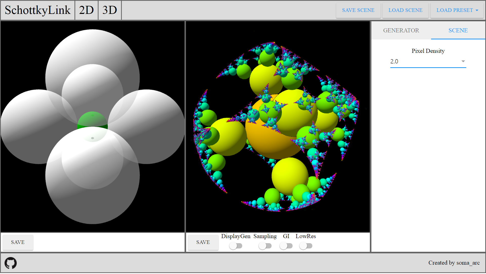

# SchottkyLink  

## Introduction
Visualized Kleinian groups has a fractal structure in most cases. They are complicated and beautiful. Including me, many artists and researchers are fascinated by them.  
In case of the Kleinian groups, the generators are often given by algebraic expressions. They don't have clear geometrical definition and meanings. If we define all of generators by compositions of inversions, we can get a geometrical intuition like Schottky groups.  
In this system, any generator is given by the inversion of a circle (or a sphere or a plane) or a composition of some inversions.  It is important for us to observe and control these generators in a geometrical way. It will be helpful to researchers and also fractal artists. This system allows us to construct complicated Kleinian groups intuitively.

## Usage
Access to the URL: [schottky.jp](http://schottky.jp) or download the source code and simply open the index.html. Currently, this system is tested on Chrome only.
#### 2 Dimensional mode

- Left Click: Select a generator
- Right Click: Move on screen
- Wheel Click: Add a Circle
- Wheel: Zoom
- Double Left Click: Remove a generator
- \+ / - : Increase / Decrease maximum iterations

#### QueryString
All Angle parameters are in degrees.

- backgroundColor=float,float,float,float  
Set backgounr color. (reg, green, blue, alpha) [0, 1]

- generatorBoundaryColor=float,float,float  
Set boundary color of generators (e.g. circumference of a circle). (red, green, blue) [0, 1]

- scale=float  
Set scene scale.

- translateX=float  
Set translate x.

- translateY=float  
Set tramslate y.

- maxIterations=Integer  
Set max iterations of inversions. [0, 100]

- download=boolean  
if download == true, save and download canvas image.

- renderGenerator=boolean  
if renderGenerator == true, render generator (only render OrbitSeed and VideoOrbit.)

- Circle[]=float,float,float  
Add Circle to the scene (Center X, Center Y, Radius)

- HalfPlane[]=float,float,float  
Add HalfPlane to the scene (Origin X, Origin Y, Normal Angle)

- Rotation[]=float,float,float,float  
Add Rotation to the scene (Origin X, Origin Y, Boundary Angle, Rotation Angle)

- CrossingInversions[]=float,float,float,float  
Add CrossingInversions to the scene (Origin X, Origin Y, Boundary Angle, Crossing Angle)

- GlideReflection[]=float,float,float,float  
Add GlideReflection to the scene (Origin X, Origin Y, Normal Angle, Distance)

- ParallelInversions[]=float,float,float,float  
Add ParallelInversions to the scene (Origin X, Origin Y, Normal Angle, Distance)

- ParallelTranslation[]=float,float,float,float  
Add ParallelTranslation to the scene (Origin X, Origin Y, Normal Angle, Distance)

- OrbitSeed[]=float,float,float  
Add OrbitSeed to the scene (Origin X, Origin Y, Width, Height)  
OrbitSeed automatically keeps the aspect ratio of the texture.
The Size parameter determines the width of the rendered OrbitSeed, and the height is computed by the width and the aspect ratio.

- VideoOrbit[]=float,float,float,float  
Add VideoOrbit to the scene (Origin X, Origin Y, Width, Height)

- Scaling[]=float,float,float,float,float  
Add Scaling to the scene (Center X, Center Y, C1 Radius, C2 Radois, Rotation Angle)

- TwoCircles[]=float,float,float,float,float,float  
Add TwoCircles to the scene (C1 Center X, C1 Center Y, C1 Radius, C2 Center X, C2 Center Y, C2 Radius)

- Loxodromic[]=float,float,float,float,float,float,float,float  
Add Loxodromic to the scene (C1 Center X, C1 Center Y, C1 Radius, C2 Center X, C2 Center Y, C2 Radius, Point X, Point Y)

##### Examples
?scale=10&Circle[]=1,1,1&Circle[]=1,-1,1&Circle[]=-1,1,1&Circle[]=-1,-1,1

#### 3 Dimensional mode

- Left Click: Select a generator
- Right Click: Move on screen
- Wheel Drag: Rotate camera
- Wheel: Zoom
- Double Left Click: Remove a generator
- z + Drag : Move selected object along the x axis
- x + Drag : Move selected object along the y axis
- c + Drag : Move selected object along the z axis
- s + Drag : Tweak radius of selected sphere
- \+ / - : Increase / Decrease maximum iterations

## Generators
### 2 Dimensional
- Circle
- Circle with infinite radius
- Composition of two circles
- Loxodromic

### 3 Dimensional
- Sphere
- Sphere with infinite radius
- Translation
- Composition of two spheres
- Compound Loxodromic

## Algorithm
Conventionally, to visualize Schottky groups we traversed Cayley graph composed of its generators.
However, It have some faults. For example, it takes too much time if the number of generators is large or we require high quality images.
We have developed an efficient algorithm for drawing orbit of Kleinian groups based on Schottky groups. It is called [Iterated Inversion System (IIS)](https://github.com/soma-arc/IteratedInversionSystem). It allows us to perform calculation in parallel and render images fast. We use a Fragment Shader in the OpenGL Shading Language.
## Reference
- Kento Nakamura and Kazushi Ahara, A New Algorithm for Rendering Kissing Schottky Groups, Bridges Finland 2016 Short Papers  
	- [Paper](http://archive.bridgesmathart.org/2016/bridges2016-367.html)
	- [Slide deck from my talk](https://speakerdeck.com/soma_arc/a-new-algorithm-for-rendering-kissing-schottky-groups)
- Kento Nakamura, An interactive visualization system on a family of Kleinian groups based on Schottky groups, Workshop "Topology and Computer 2016" Talk
 	- [Slide deck](https://speakerdeck.com/soma_arc/an-interactive-visualization-system-on-a-family-of-kleinian-groups-based-on-schottky-groups)

## Author
- soma_arc (Kento Nakamura)

## Copyright
Copyright (c) 2016 soma_arc (Kento Nakamura)
## License
Licensed under GPL-3.0
